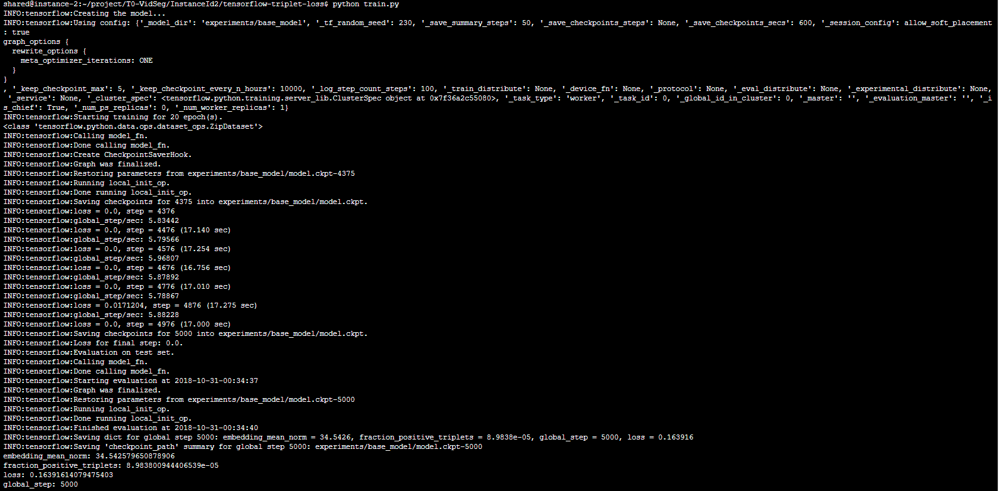

# (Work in Progress) InstaceID for Real-time Video Multi-instance Object Segmentation

This repository contains the current progress of the Instance Identification module of Video Segmentation.

## InstanceID 

A video is a consecutive series of image frames, to keep track of instances across multiple frames, we need to re-assign an instance ID to each trackable object instance. Without the ability to track and re-assign an instance ID across consecutive frames, we would end up with a new set of object instances on each frame.

The InstanceID module is designed to provide either a new instance ID label for each new instance of an object or reassign an existing instance ID for each previously identified instance. 

The InstanceID module maintains a database of features of previously identified instances. The InstanceID features are generated by representing the foreground segmentation of an identified instance as an embedded feature vector. The embedded feature vector maps an input image from a tensor to a vector. In the context of instance re-identification, this allows vector distance to be applied to calculate how a new instance is similar to a previously identified instance.

## Triplet Loss

| |
|:--:|
| *Triplet loss on two positive faces (Obama) and one negative face (Macron) -- (Image taken from Olivier Moindrot)* |

The embedded feature vector is trained using a triplet loss network. To obtain data to train the triplet loss network, we wrote a script that scans through our training video to obtain the foreground segment of each trackable object instance. This process produces a large set of positive examples for each object of the same instance. For each pair of positive example, we randomly sample a negative example from the foreground segments of other instances.

Triplet Loss is what we are working to currently implement. We are using [Olivier Moindrot's Triplet Loss Model](https://github.com/omoindrot/tensorflow-triplet-loss/) and made modifications to the model work and train with the Davis 2017 dataset that we are using. We also used [Gregory S. Kielian's JPEG to MSINT-NN format](https://github.com/gskielian/JPG-PNG-to-MNIST-NN-Format) in order to transform our dataset into a MSINT format that would be accepted by the model. Next steps are to further modify the model in order to have higher accuracy and for better training to be done, as well as modifying the anchor, positive, and negative inputs for a better model. 

Running the triplet loss model at its current state is as simple as going into the tensorflow-triplet-loss dir and typing 'python train.py' where (currently a portion of) the modified Davis 2017 data will be run through the network. 

## TODO

The final goal of InstanceID is that during inference mode, the InstanceID module takes in an instance foreground segmentation from the ImageSeg module to re-identify a previously identified instance. An instance is re-identified when the L2 distance of the embedded feature vector is below the optimal threshold and if there are multiple matches, we take take the ID with the lowest L2 distance. If there are no matches, a new ID is assigned to the instance. For each instance identified, the embedded feature vector is updated in the database for pairwise distance calculations on the future frames.

We need to continue to implement tools such as FAISS as well as connect different parts of the model in order to have InstanceID working properly. 
