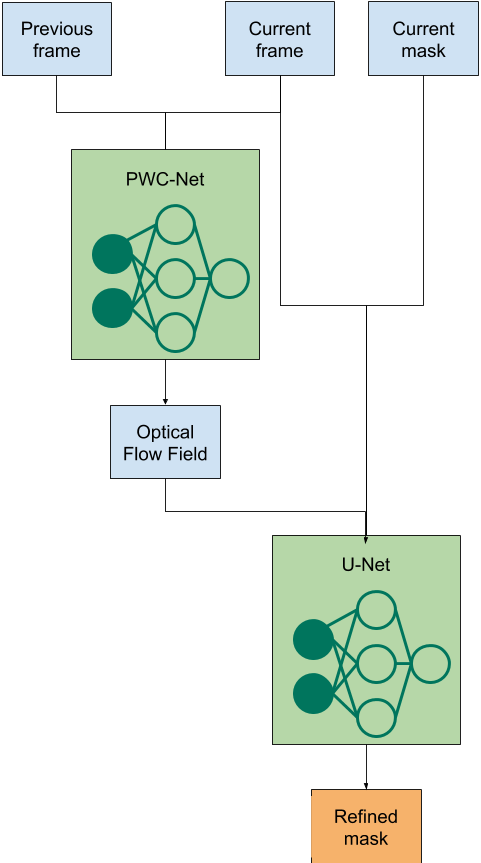

Mask Refine
===========

The Mask Refine module is responsible for estimating the location of the mask for an object in the
current frame given the previous frame, current frame, and the output of Mask-RCNN on the current frame.

The model works as follows:
1. Runs the previous image and the current image through a PWC-Net to get the optical flow field
from the previous image to the current image.
2. Runs the current image, the optical flow field, and a predicted mask for a specific object from the
current image through a U-Net to get the refined mask the same object in the current image.

Here is a diagram of the process:

Demo Script
-----------
Open the [demo_mask_refine.ipynb](../evaluate/demo_mask_refine.ipynb) notebook and run block by block!
Note: the notebook is in the root directory of the repository because it needs access to files
outside of this directory.

Future Steps
------------
1. Implement improved loss that weights changes in the mask higher than unchanged pixels in the loss function.
2. Find a non-hacky solution to work with PWC-Net.